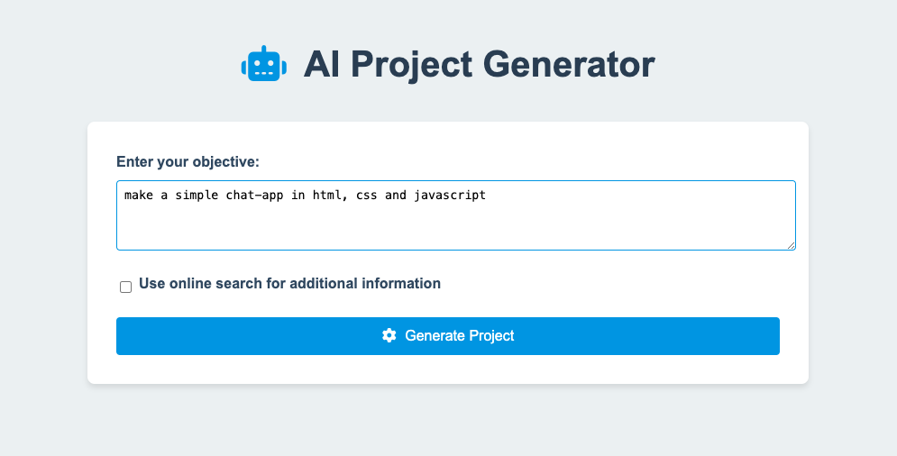
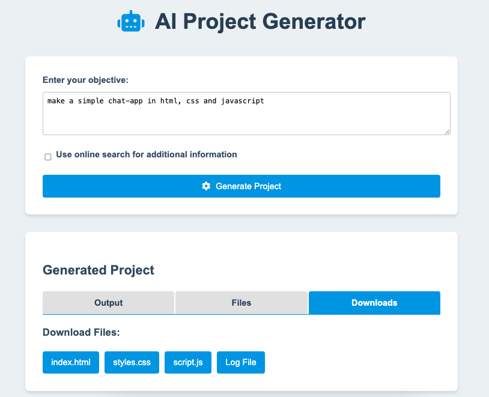
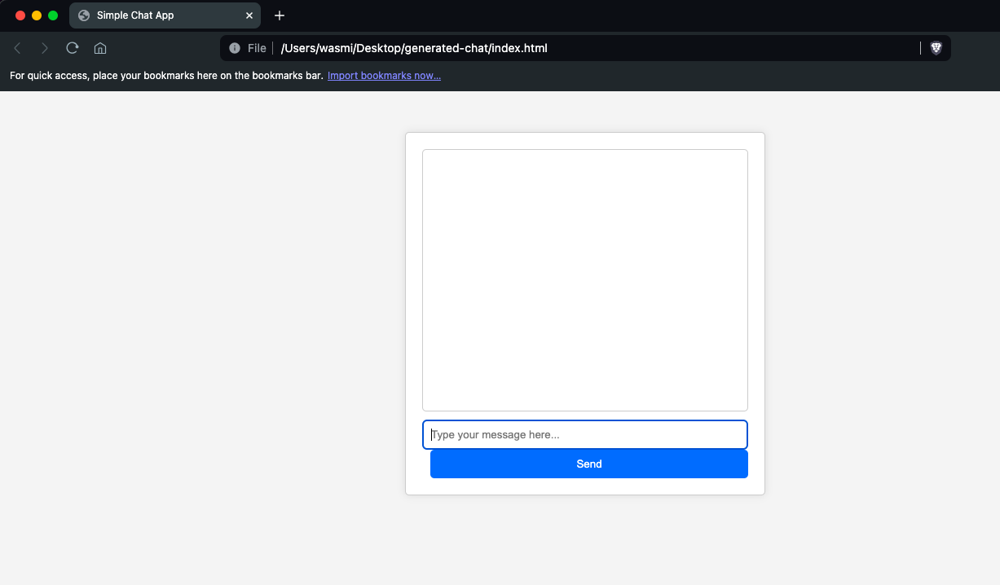

# Project Generator: the multi-agent AI Project Generator
## Overview

AI Project Generator is a web application that leverages multi-agent AI workflow to automatically generate project structures, code, and documentation based on user-provided objectives. This tool aims to streamline the project initialization process for developers, saving time and providing a solid starting point for various coding projects.

The best part is that all the code generate by the agents is output as code files. Meaning with a simple prompt, an entire project is coded and given to the user ready.

## Table of Contents
1. [Overview](#overview)
2. [Key Features](#key-features)
3. [Technology Stack](#technology-stack)
4. [Architecture](#architecture)
5. [Key Components](#key-components)
6. [Workflow](#workflow)
7. [Installation](#installation)
8. [Usage](#usage)
9. [Code Highlights](#code-highlights)
10. [Challenges and Solutions](#challenges-and-solutions)
11. [Future Enhancements](#future-enhancements)

## Demo screenshots of the app

First the user is prompted to input what they want to be built by the AI agents

After a few seconds to a few minutes (depending on the complexity of the job), the agents ouput result file(s).

Here is a simple example of a chat web-app produced in less than 20 seconds after the input!

## Key Features

- **Natural Language Processing**: Utilizes OpenAI's GPT models to understand and process user objectives.
- **Intelligent Task Breakdown**: Automatically breaks down complex objectives into manageable sub-tasks.
- **Code Generation**: Creates project structures and generates initial code files across multiple languages.
- **Web-based Interface**: Offers an intuitive, responsive web interface for easy interaction.
- **File Management**: Generates a complete folder structure and multiple code files as needed.
- **Documentation**: Automatically creates a detailed log file documenting the project generation process.
- **Download Functionality**: Allows users to download generated files directly from the web interface.
- **Multi-language Support**: Capable of generating code in various programming languages.
- **Code Validation**: Implements basic validation for generated code to ensure quality.
- **Optional Web Search**: Can utilize online search for additional information during project generation.

## Technology Stack

- **Backend**: Python with Flask web framework
- **Frontend**: HTML, CSS, and JavaScript
- **AI Integration**: OpenAI API for natural language processing and code generation
- **Additional Libraries**: 
  - Rich: For console output formatting
  - Tavily: For web search functionality (optional feature)
  - Various parsing libraries: For code validation (html5lib, pylint, esprima, etc.)
  - python-dotenv: For environment variable management
  - rdflib: For RDF data processing
  - rpy2: For R language integration

## Architecture

The application follows a client-server architecture:

1. **Web Interface** (HTML/CSS/JavaScript):
   - Provides a user-friendly form for inputting project objectives
   - Displays generated results in tabbed sections (Output, Files, Downloads)
   - Handles asynchronous communication with the server

2. **Flask Server** (Python):
   - Processes user requests
   - Coordinates the AI-driven project generation workflow
   - Manages file creation and serves downloads

3. **AI Processing Pipeline**:
   - Orchestrator: Breaks down objectives into sub-tasks
   - Sub-Agent: Executes individual tasks and generates code
   - Refiner: Synthesizes results into a cohesive final output

## Key Components

1. **main.py**: Core logic for AI-driven project generation
   - Implements the AI processing pipeline
   - Handles code generation and validation
   - Manages file and folder creation

2. **app.py**: Flask server setup and route definitions
   - Defines API endpoints for processing requests and serving files
   - Integrates with the main project generation logic

3. **static/script.js**: Client-side JavaScript for dynamic UI updates
   - Handles form submission and asynchronous requests
   - Updates the UI with generated project information
   - Manages tab functionality for result display

4. **static/style.css**: Responsive styling for the web interface
   - Implements a clean, modern design
   - Ensures responsiveness across different device sizes

5. **templates/index.html**: Main HTML template for the web application
   - Structures the user interface
   - Integrates with CSS and JavaScript files

## Workflow

1. User inputs a project objective through the web interface
2. The server processes the request, initiating the AI pipeline
3. The Orchestrator breaks down the objective into sub-tasks
4. Sub-Agents execute each task, generating code and project structure
5. The Refiner consolidates the results into a final output
6. Generated files and documentation are created on the server
7. Results are displayed to the user, with options to view and download files

## Installation

1. Clone the repository
2. Install required dependencies using pip
3. Set up environment variables for API keys
4. Run the Flask application
5. Open a web browser and navigate to the local server address

## Usage

1. Enter your project objective in the text area on the home page
2. (Optional) Check the box to enable web search for additional information
3. Click "Generate Project"
4. Wait for the AI to process your request (this may take a few moments)
5. Review the generated output, file list, and download the created files

## Code Highlights

- AI Model Integration in main.py
- Asynchronous Request Handling in static/script.js
- Modular AI processing pipeline
- Comprehensive error handling and retry mechanisms

## Challenges and Solutions

1. **Challenge**: Ensuring code quality across multiple languages
   **Solution**: Implemented language-specific validation functions using various parsing libraries

2. **Challenge**: Managing complex AI-driven workflows
   **Solution**: Developed a modular architecture with separate functions for orchestration, execution, and refinement

3. **Challenge**: Handling potential API failures and timeouts
   **Solution**: Implemented retry mechanisms and proper error handling throughout the application

## Future Enhancements

- Integration with version control systems (e.g., Git)
- Support for more programming languages and frameworks
- User accounts for saving and managing multiple projects
- AI-driven code optimization and refactoring suggestions
- Integration with popular IDEs as a plugin
- Collaborative features for team projects
- Enhanced code analysis and best practice recommendations
